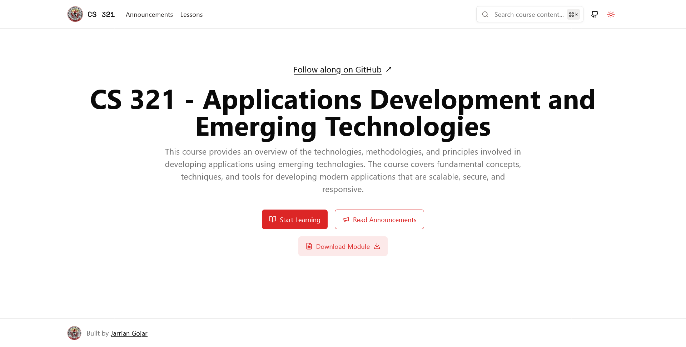

# CS-321: Applications Development and Emerging Technologies



Educational website for CS-321 course lessons and documentation built with Next.js.

## Getting Started

First, run the development server:

```plaintext
npm run dev
# or
yarn dev
```

## Course Content

This project contains lessons covering:

- **Introduction to Application Development and Emerging Technologies**
- **Web Development** (HTML, CSS, JavaScript)
- **Version Control** (Git & GitHub)
- **Next.js** Framework
- **Next.js Libraries**:
  - UI Libraries (Tailwind CSS, shadcn/ui, Material UI)
  - Animation and Effects Libraries (GSAP, Framer Motion)
  - Charts and Data Visualization Libraries (Recharts, ApexCharts)

## Project Structure

```plaintext
contents/
└── lessons/
    ├── intro-to-app-dev-and-em-tech/
    ├── web-development/
    ├── version-control/
    ├── nextjs/
    └── nextjs-libraries/
```
